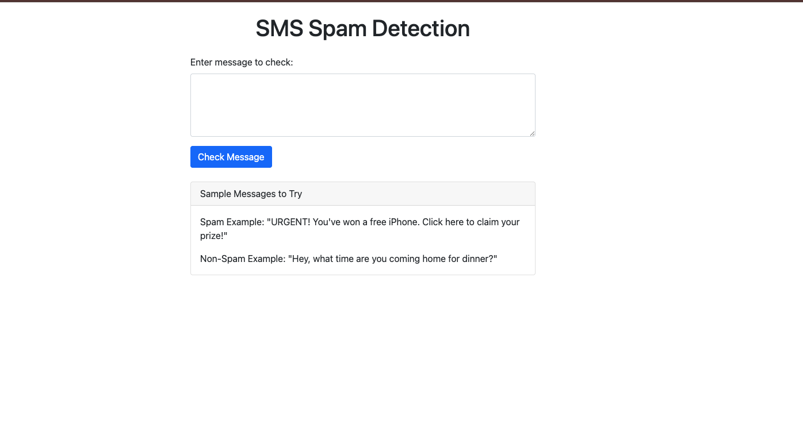
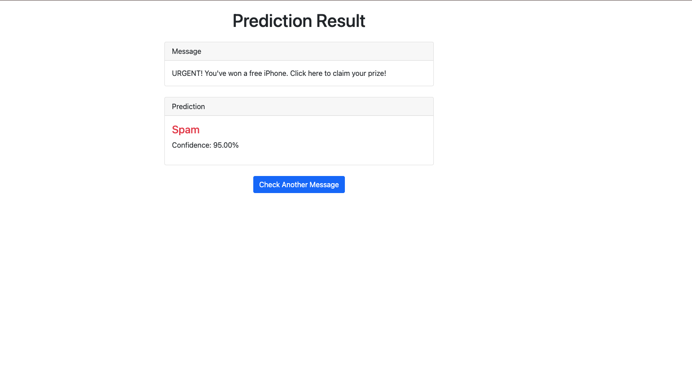

# SMS Spam Detection

A machine learning-based SMS spam detection system with web interface and API support. The system can analyze messages in both English and Turkish to classify them as spam or not spam.

## Features

- Multilingual support (English and Turkish)
- Advanced text preprocessing
- TF-IDF and custom feature extraction
- Web interface for easy testing
- RESTful API for integration
- 98.10% accuracy on test set

## Project Structure

```
.
├── README.MD
├── app.py
├── data
│   ├── processed
│   │   ├── features.csv
│   │   └── processed_spam.csv
│   └── raw
│       └── sms_spam_train.csv
├── data_processing.py
├── main.py
├── models
│   └── trained_model.pkl
├── notebooks
├── requirements.txt
├── src
│   ├── __init_.py
│   ├── __pycache__
│   │   ├── features.cpython-310.pyc
│   │   ├── model.cpython-310.pyc
│   │   └── preprocessing.cpython-310.pyc
│   ├── features.py
│   ├── model.py
│   ├── preprocessing.py
│   └── utils.py
├── templates
│   ├── api_docs.html
│   ├── index.html
│   └── result.html
└── tests
    └── test_preprocessing.py
```

## Installation

1. Clone the repository:
```bash
git clone https://github.com/enesfarukkeskin/sms-spam-detection.git
cd sms-spam-detection
```

2. Create and activate virtual environment:
```bash
python -m venv venv
source venv/bin/activate  # Linux/Mac
# or
venv\Scripts\activate     # Windows
```

3. Install required packages:
```bash
pip install -r requirements.txt
```

## Usage

### 1. Data Processing and Model Training

Process the raw data and train the model:
```bash
# Process data
python data_processing.py

# Train model
python main.py
```

## Web Application Usage

### Starting the Web Application

1. Ensure the model is trained and saved:
```bash
python main.py
```

2. Start the Flask application:
```bash
python app.py
```

3. Access the application:
- Open your browser and navigate to `http://localhost:5001`
- The API documentation is available at `http://localhost:5000/api/docs`

### Using the Web Interface

1. **Home Page** (`/`):
   - Enter your message in the text area
   - Click "Check Message" to get the prediction
   - Sample messages are provided for testing




2. **Results Page**:
   - Displays the original message
   - Shows the prediction (Spam/Not Spam)
   - Includes confidence score
   - Option to check another message


### 3. API Usage

Make predictions via API:
```python
import requests

url = "http://localhost:5000/predict"
data = {
    "message": "Message to check"
}
response = requests.post(url, json=data)
result = response.json()
```

Using curl:
```bash
curl -X POST http://localhost:5000/predict \
     -H "Content-Type: application/json" \
     -d '{"message": "Message to check"}'
```

## Model Performance

Results on test set (2 February 2025):
- Accuracy: 98.10%
- Precision (Spam): 96.37%
- Recall (Spam): 98.08%
- F1-Score: 97.21%

## Web Interface Features

1. Main Page (`/`)
   - Text input form
   - Sample messages
   - Simple and intuitive interface

2. Results Page
   - Prediction result
   - Confidence score
   - Option to check another message

3. API Documentation (`/api/docs`)
   - Endpoint details
   - Request/response formats
   - Usage examples

## Implementation Details

### Text Preprocessing
- Case normalization
- Special character handling
- URL and email detection
- Turkish character support
- Stopword removal (bilingual)
- Lemmatization

### Feature Engineering
- TF-IDF vectorization
- N-gram analysis (1-2 grams)
- Text length features
- Special character ratios
- URL/email presence
- Currency mentions

### Model Architecture
- Linear SVM classifier
- Class weight balancing
- Optimized hyperparameters
- Cross-validation support

## API Documentation

### Endpoints

#### POST /predict
Make a spam prediction

Request format:
```json
{
    "message": "Message text to analyze"
}
```

Response format:
```json
{
    "message": "Original message",
    "prediction": "Spam or Not Spam",
    "confidence": 0.95
}
```


## Future Improvements (I DON'T HAVE TIME TO DO THESE)

1. Model Enhancements
   - BERT implementation
   - Language-specific models
   - Ensemble methods

2. Feature Development
   - Real-time model updates
   - Performance monitoring
   - Additional language support

3. System Updates
   - Docker containerization
   - CI/CD pipeline
   - Automated retraining

## Contact

Enes Faruk Keskin - [enesfarukkeskin@gmail.com]
